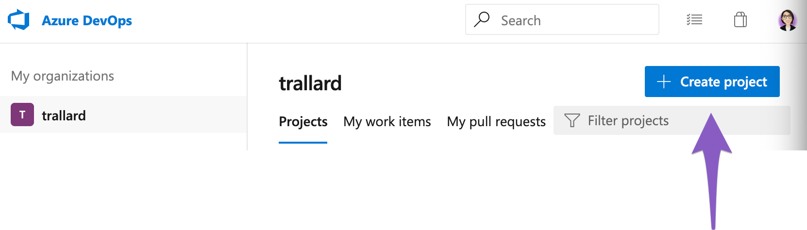

# Using Azure pipelines for continuous delivery of your BinderHub

### Why using continuous integration?

As you set up your own BinderHub (or your institutional one) you might encounter yourself making a number of updates or upgrades based on your or your users' needs. So instead of manually upgrading your deployment each time you can set a pipeline that will be triggered whenever an "event" occurs and deploys the updated version of your Hub for you. Very nifty 😎.

These so called "events" can be anything like: merging a PR into master, creating a new release of your project, pushing to a specific branch. 

## Pre-requisites and setup

- Azure DevOps account If you do not have one you can get one for free [following this link](https://azure.microsoft.com/en-gb/services/devops/pipelines//?wt.mc_id=binderhub-github-taallard).
- Azure Subscription: needed to provision the Azure services for this demonstration. If you don’t have one, you can get a free trial one here

## What technologies will be using?
- BinderHub
- Azure Devops: to implement your CI/CD pipelines
- Docker
- Helm
- Kubernetes 
- Azure Kubernetes Service (AKS)
- Azure container registry

## Getting started 
The documentation (including the quickstart guides) for Azure pipelines can be found 👉🏼[here](https://docs.microsoft.com/en-gb/azure//?wt.mc_id=binderhub-github-taallard).

1. Log into your Azure DevOps account at 👉🏼 [https://dev.azure.com/](https://dev.azure.com/)
2. Click on the *+ Create project button* 
   
3. Fill in the details of your project in the following screen (make sure to give it a memorable name, perhaps one matching the repository name) and click *create* when complete. 
4.  