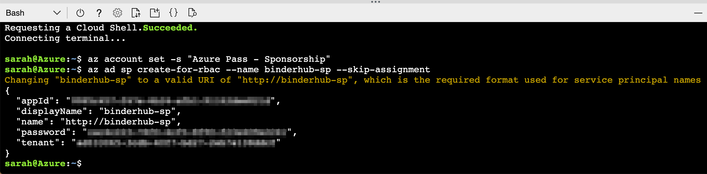

# Automatically deploy a BinderHub to Microsoft Azure

  

[BinderHub](https://binderhub.readthedocs.io/en/latest/index.html) is a cloud-based, multi-server technology used for hosting repoducible computing environments and interactive Jupyter Notebooks.

This repo contains a set of scripts to automatically deploy a BinderHub onto [Microsoft Azure](https://azure.microsoft.com/en-gb/) and connect a [DockerHub](https://hub.docker.com/) container registry.

This repo is based on the following set of deployment scripts for Google Cloud: [nicain/binder-deploy](https://github.com/nicain/binder-deploy)

You will require a Microsoft Azure account and subscription.
A Free Trial subscription can be obtained [here](https://azure.microsoft.com/en-gb/free/).
You will be asked to provide a credit card for verification purposes.
**You will not be charged.**
Your resources will be frozen once your subscription expires, then deleted if you do not reactivate your account within a given time period.

## Table of Contents

- [Usage](#usage)
  - [`setup.sh`](#setupsh)
  - [`deploy.sh`](#deploysh)
  - [`logs.sh`](#logssh)
  - [`info.sh`](#infosh)
  - [`teardown.sh`](#teardownsh)
- ["Deploy to Azure" Button](#deploy-to-azure-button)
  - [Service Principal Creation](#service-principal-creation)
- [Contributors](#contributors)

---

## Usage

To use these scripts locally, clone this repo and change into the directory.

```
git clone https://github.com/alan-turing-institute/binderhub-deploy.git
cd binderhub-deploy
```

The Python files [`create_config.py`](./create_config.py) and [`create_secret.py`](./create_secret.py) require Python version `>= 3.6`, but no extra packages are needed.

To make the scripts executable and then run them, do the following:

```
chmod 700 <script-name>.sh
./<script-name>.sh
```

To build the BinderHub, you should run `setup.sh` first, then `deploy.sh`.
You can run `logs.sh` and `info.sh` to get the JupyterHub logs and IP addresses respectively.
`teardown.sh` should only be used to delete your BinderHub deployment.

Create a file called `config.json` which has the following format.
Fill the quotation marks with your desired namespaces, etc.

* For a list of available data centre regions, [see here](https://azure.microsoft.com/en-us/global-infrastructure/locations/). This should be a _region_ and **not** a _location_, e.g. "West Europe" or "Central US". These can be equivalently written as `westeurope` and `centralus`, respectively.
* For a list of available Linux Virtual Machines, [see here](https://docs.microsoft.com/en-gb/azure/virtual-machines/linux/sizes-general). This should be something like, e.g., `Standard_D2s_v3`.

```
{
  "azure": {
    "subscription": "",  // Azure subscription name
    "res_grp_name": "",  // Azure Resource Group name
    "location": "",      // Azure Data Centre region
    "node_count": 1,     // Number of nodes to deploy. 3 is preferrable for a stable cluster, but may be liable to caps.
    "vm_size": ""        // Azure virtual machine type to deploy
  },
  "binderhub": {
    "name": "",          // Name of your BinderHub
    "version": ""        // Helm chart version to deploy, should be 0.2.0-<commit-hash>
  },
  "docker": {
    "org": null,         // A DockerHub organisation to push images to (if desired)
    "image_prefix": ""   // The prefix to preprend to Binder images (e.g. "binder-prod")
  }
}
```

You can copy [`template-config.json`](./template-config.json) should you require.

#### Important for Free Trial subscriptions

If you have signed up to an Azure Free Trial subscription, you are not allowed to deploy more than 4 **cores**.
How many cores you deploy depends on your choice of `node_count` and `vm_size`.

For example, a `Standard_D2s_v3` machine has 2 cores.
Therefore, setting `node_count` to 2 will deploy 4 cores and you will have reached your quota for cores on your Free Trial subscription.

### setup.sh

This script checks whether the required command line programs are already installed, and if any are missing uses the system package manager or [`curl`](https://curl.haxx.se/docs/) to install command line interfaces (CLIs) for [Microsoft Azure (`azure-cli`)](https://docs.microsoft.com/en-us/cli/azure/install-azure-cli-linux?view=azure-cli-latest#install-or-update), [Kubernetes (`kubectl`)](https://kubernetes.io/docs/tasks/tools/install-kubectl/#install-kubectl-binary-using-curl), [Helm (`helm`)](https://helm.sh/docs/using_helm/#from-script), along with dependencies that are not automatically installed by those packages.

### deploy.sh

This script reads in values from `config.json`, deploys a Kubernetes cluster, then creates `config.yaml` and `secret.yaml` files via `create_config.py` and `create_secret.py` respectively (using [`config-template.yaml`](./config-template.yaml) and [`secret-template.yaml`](./secret-template.yaml)).
The script will ask for your Docker ID and password.
The ID is your Docker username, **NOT** the associated email.
If you have provided a Docker organisation in `config.json`, then Docker ID **MUST** be a member of this organisation.
Both a JupyterHub and BinderHub are installed onto the deployed Kubernetes cluster and the `config.yaml` file is updated with the JupyterHub IP address.

### logs.sh

This script will print the JupyterHub logs to the terminal for debugging.
It reads from `config.json` in order to get the BinderHub name.

### info.sh

The script will print the pod status of the cluster and the IP addresses of both the JupyterHub and BinderHub to the terminal.
It reads the BinderHub name from `config.json`.

### teardown.sh

This script will purge the Helm release, delete the Kubernetes namespace and then delete the Azure Resource Group containing the computational resources.
It will read the namespaces from `config.json`.
The user should check the [Azure Portal](https://portal.azure.com/#home) to verify the resources have been deleted.

## "Deploy to Azure" Button

To deploy [BinderHub](https://binderhub.readthedocs.io/) to Azure use the deploy button below.

[](https://portal.azure.com/#create/Microsoft.Template/uri/https%3A%2F%2Fraw.githubusercontent.com%2Ftmbgreaves%2Fbinderhub-deploy%2Fchange-urls-to-upstream%2Fazure%2Fpaas%2Farm%2Fazure.deploy.json)

### Service Principal Creation

You will be asked to provide a [Service Principal](https://docs.microsoft.com/en-us/azure/active-directory/develop/app-objects-and-service-principals) in the form launched when you click the deploy to Azure button above.

To create a Service Principal, go to the [Azure Portal](https://portal.azure.com/) (and login!) and open the Cloud Shell:

<html></html>

You may be asked to create storage when you open the shell.
This is expected, click "Create".

Make sure the shell is set to Bash, not PowerShell.

<html></html>

Set the subscription you'd like to deploy your BinderHub on.

```
az account set -s <subscription>
```

This image shows the command being executed for an Azure Pass Sponsorship.

<html></html>

Next, create the Service Principal with the following command. Make sure to give it a sensible name.

```
az ad sp create-for-rbac --name binderhub-sp --skip-assignment
```

<html></html>

The fields `appId`, `password` and `tenant` are the required pieces of information.
These should be copied into the "Service Principal App ID", "Service Principal App Key" and "Service Principal Tenant ID" fields in the form, respectively.

**Keep this information safe as the password cannot be recovered after this step!**

## Contributors

We would like to acknowledge and thank the following people for their contributions:

* Tim Greaves (@tmbgreaves)
* Gerard Gorman (@ggorman)
* Tania Allard (@trallard)
* Diego Alonso Alvarez (@dalonsoa)
