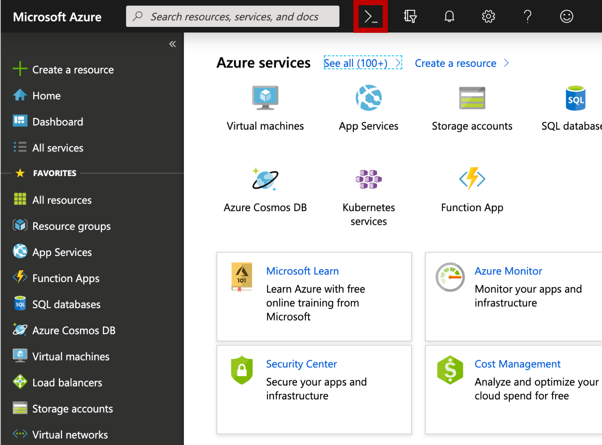
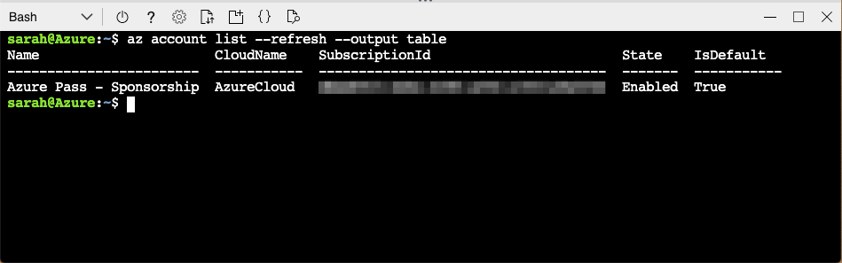
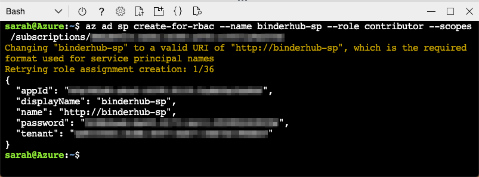
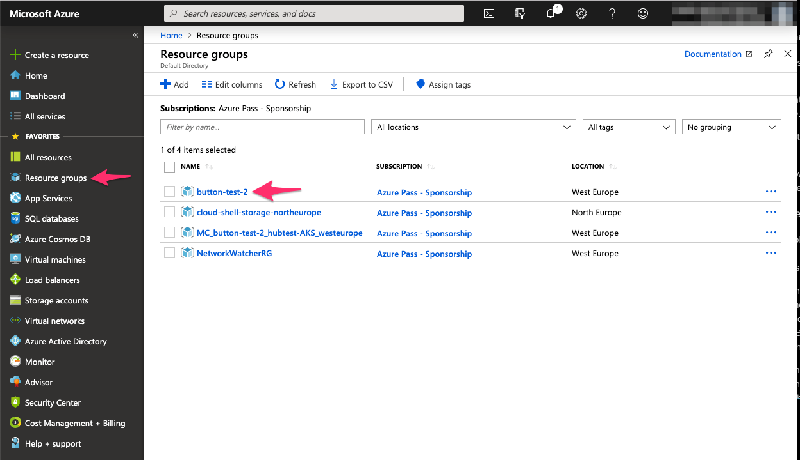
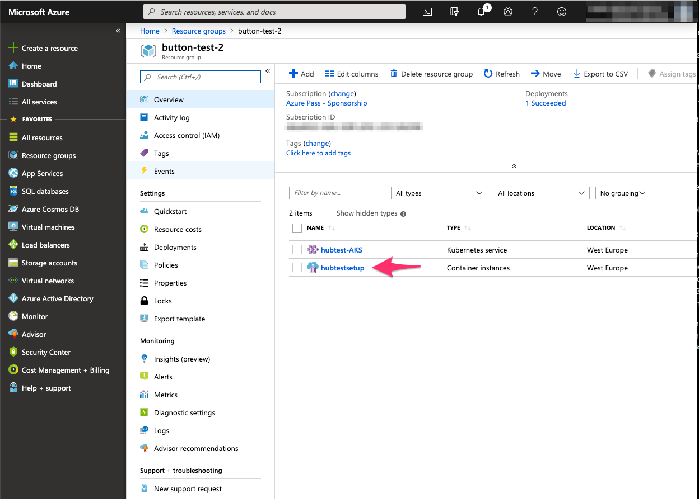
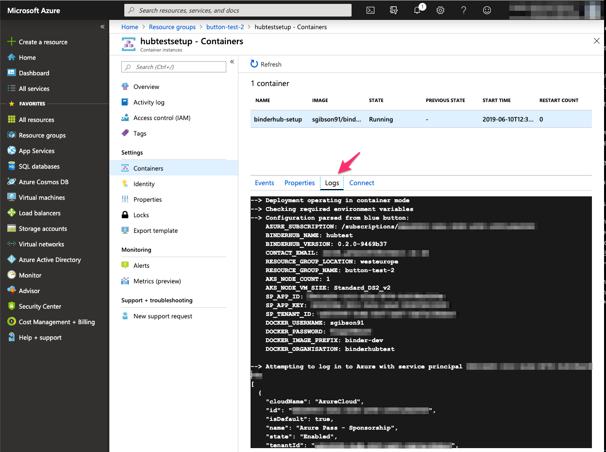
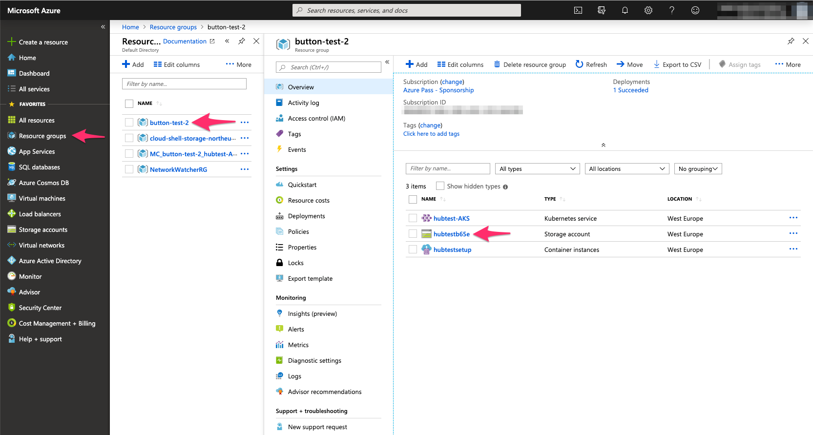
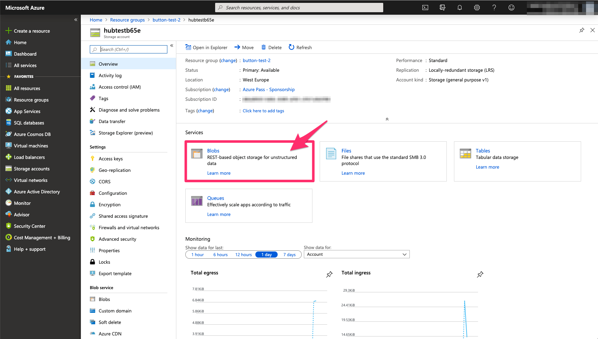
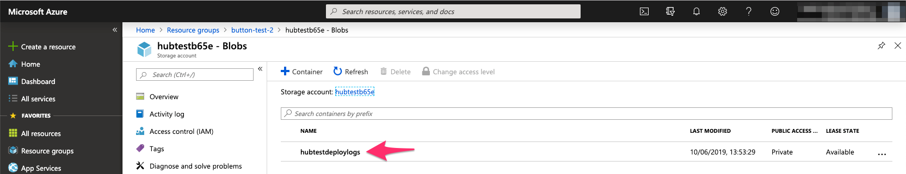

# Automatically deploy a BinderHub to Microsoft Azure

[](LICENSE) [](https://hub.docker.com/repository/docker/sgibson91/binderhub-setup) [](https://github.com/alan-turing-institute/binderhub-deploy/actions?query=workflow%3A%22Lint+Dockerfile%22+branch%3Amain) [](https://github.com/alan-turing-institute/binderhub-deploy/actions?query=workflow%3A%22Check+Setup%22+branch%3Amain) [](https://github.com/alan-turing-institute/binderhub-deploy/actions?query=workflow%3A%22Run+shellcheck+and+shfmt%22+branch%3Amain) [](https://github.com/alan-turing-institute/binderhub-deploy/actions?query=workflow%3Ayamllint+branch%3Amain) [](CODE_OF_CONDUCT.md) [](CONTRIBUTING.md) [](https://github.com/alan-turing-institute/binderhub-deploy/labels/good%20first%20issue) [](https://github.com/alan-turing-institute/binderhub-deploy/labels/help%20wanted)<!-- ALL-CONTRIBUTORS-BADGE:START - Do not remove or modify this section -->
[](#contributors-)
<!-- ALL-CONTRIBUTORS-BADGE:END -->

[BinderHub](https://binderhub.readthedocs.io/en/latest/index.html) is a cloud-based, multi-server technology used for hosting repoducible computing environments and interactive Jupyter Notebooks built from code repositories.

This repository contains a set of scripts to automatically deploy a BinderHub onto [Microsoft Azure](https://azure.microsoft.com/en-gb/), and connect either a [Docker Hub](https://hub.docker.com/) account/organisation or an [Azure Container Registry](https://azure.microsoft.com/en-gb/services/container-registry/), so that you can host your own [Binder](https://mybinder.readthedocs.io/en/latest/) service.

This repository is based on the following set of deployment scripts for Google Cloud: [nicain/binder-deploy](https://github.com/nicain/binder-deploy)

You will require a Microsoft Azure account and subscription.
A Free Trial subscription can be obtained [here](https://azure.microsoft.com/en-gb/free/).
You will be asked to provide a credit card for verification purposes.
**You will not be charged.**
Your resources will be frozen once your subscription expires, then deleted if you do not reactivate your account within a given time period.
If you are building a BinderHub as a service for an organisation, your institution may already have an Azure account.
You should contact your IT Services for further information regarding permissions and access (see the [Service Principal Creation](#sparkles-service-principal-creation) section below).

Please read our :purple_heart: [Code of Conduct](CODE_OF_CONDUCT.md) :purple_heart: and :space_invader: [Contributing Guidelines](CONTRIBUTING.md) :space_invader:

**Table of Contents:**

- [:children_crossing: Usage](#children_crossing-usage)
  - [:package: Choosing between Docker Hub and Azure Container Registry](#package-choosing-between-docker-hub-and-azure-container-registry)
  - [:closed_lock_with_key: Enabling HTTPS for a Domain Name](#closed_lock_with_key-enabling-https-for-a-domain-name)
  - [:vertical_traffic_light: `setup.sh`](#vertical_traffic_light-setupsh)
  - [:rocket: `deploy.sh`](#rocket-deploysh)
  - [:inbox_tray: `set-a-records.sh`](inbox_tray-set-a-recordssh)
  - [:bar_chart: `logs.sh`](#bar_chart-logssh)
  - [:information_source: `info.sh`](#information_source-infosh)
  - [:arrow_up: `upgrade.sh`](#arrow_up-upgradesh)
  - [:boom: `teardown.sh`](#boom-teardownsh)
- [:rocket: "Deploy to Azure" Button](#rocket-deploy-to-azure-button)
  - [:sparkles: Service Principal Creation](#sparkles-service-principal-creation)
  - [:chart_with_upwards_trend: Monitoring Deployment Progress](#chart_with_upwards_trend-monitoring-deployment-progress)
  - [:package: Retrieving Deployment Output from Azure](#package-retrieving-deployment-output-from-azure)
  - [:unlock: Accessing your BinderHub after Deployment](#unlock-accessing-your-binderhub-after-deployment)
- [:house_with_garden: Running the Container Locally](#house_with_garden-running-the-container-locally)
- [:art: Customising your BinderHub Deployment](#art-customising-your-binderhub-deployment)
- [:computer: Developers Guide](#computer-developers-guide)
  - [:wrench: Building the Docker image for testing](#wrench-building-the-docker-image-for-testing)
  - [:label: Tagging a Release](#label-tagging-a-release)
- [:purple_heart: Contributors](#purple_heart-contributors)

---

## :children_crossing: Usage

This repo can either be run locally or as "Platform as a Service" through the "Deploy to Azure" button in the ["Deploy to Azure" Button](#rocket-deploy-to-azure-button) section.

To use these scripts locally, clone this repo and change into the directory.

```bash
git clone https://github.com/alan-turing-institute/binderhub-deploy.git
cd binderhub-deploy
```

To make the scripts executable and then run them, do the following:

```bash
cd src
chmod 700 <script-name>.sh
./<script-name>.sh
```

[**NOTE:** The above command is UNIX specific. If you are running Windows 10, [this blog post](https://www.windowscentral.com/how-install-bash-shell-command-line-windows-10) discusses using a bash shell in Windows.]

To build the BinderHub, you should run `setup.sh` first (to install the required command line tools), then `deploy.sh` (which will build the BinderHub).
Once the BinderHub is deployed, you can run `logs.sh` and `info.sh` to get the JupyterHub logs and IP addresses respectively.
`teardown.sh` should _only_ be used to delete your BinderHub deployment.

You need to create a file called `config.json` which has the format described in the code block below.
Fill the quotation marks with your desired namespaces, etc.
`config.json` is git-ignored so sensitive information, such as passwords and Service Principals, cannot not be pushed to GitHub.

- For a list of available data centre regions, [see here](https://azure.microsoft.com/en-gb/global-infrastructure/locations/).
  This should be a _region_ and **not** a _location_, for example "West Europe" or "Central US".
  These can be equivalently written as `westeurope` and `centralus`, respectively.
- For a list of available Linux Virtual Machines, [see here](https://docs.microsoft.com/en-gb/azure/virtual-machines/linux/sizes-general).
  This should be something like, for example `Standard_D2s_v3`.
- The versions of the BinderHub Helm Chart can be found [here](https://jupyterhub.github.io/helm-chart/#development-releases-binderhub) and are of the form `0.2.0-<commit-hash>`.
  It is advised to select the most recent version unless you specifically require an older one.
- If you are deploying an Azure Container Registry, find out more about the SKU tiers [here](https://docs.microsoft.com/en-gb/azure/container-registry/container-registry-skus).

```json
{
  "container_registry": "",        // Choose Docker Hub or ACR with 'dockerhub' or 'azurecr' values, respectively.
  "enable_https": "false",         // Choose whether to enable HTTPS with cert-manager. Boolean.
  "acr": {
    "registry_name": null,         // Name to give the ACR. This must be alpha-numerical and unique to Azure.
    "sku": "Basic"                 // The SKU capacity and pricing tier for the ACR
  },
  "azure": {
    "subscription": "",            // Azure subscription name or ID (a hex-string)
    "res_grp_name": "",            // Azure Resource Group name
    "location": "",                // Azure Data Centre region
    "node_count": 1,               // Number of nodes to deploy. 3 is preferrable for a stable cluster, but may be liable to caps.
    "vm_size": "Standard_D2s_v3",  // Azure virtual machine type to deploy
    "sp_app_id": "",             // Azure service principal ID
    "sp_app_key": "",            // Azure service principal password
    "sp_tenant_id": "",          // Azure tenant ID
    "log_to_blob_storage": false   // Store logs in blob storage when not running from a container
  },
  "binderhub": {
    "name": "",                    // Name of your BinderHub
    "version": "",                 // Helm chart version to deploy, should be 0.2.0-<commit-hash>
    "image_prefix": ""             // The prefix to preppend to Docker images (e.g. "binder-prod")
  },
  "docker": {
    "username": null,              // Docker username (can be supplied at runtime)
    "password": null,              // Docker password (can be supplied at runtime)
    "org": null                    // A Docker Hub organisation to push images to (optional)
  },
  "https:": {
    "certmanager_version": null,   // Version of cert-manager to install
    "contact_email": null,        // Contact email for Let's Encrypt
    "domain_name": null,          // Domain name to issue certificates for
    "nginx_version": null         // Version on nginx-ingress to install
  }
}
```

You can copy [`template-config.json`](./template-config.json) should you require.

**Please note that all entries in `template-config.json` must be surrounded by double quotation marks (`"`), with the exception of `node_count`.**

#### Important for Free Trial subscriptions

If you have signed up to an Azure Free Trial subscription, you are not allowed to deploy more than 4 **cores**.
How many cores you deploy depends on your choice of `node_count` and `vm_size`.

For example, a `Standard_D2s_v3` machine has 2 cores.
Therefore, setting `node_count` to 2 will deploy 4 cores and you will have reached your quota for cores on your Free Trial subscription.

### :package: Choosing between Docker Hub and Azure Container Registry

To select either a Docker Hub account/organisation or an Azure Container Registry (ACR), you must set the top-level `container_registry` key in `config.json` to either `dockerhub` or `azurecr` respectively.
This will tell `deploy.sh` which variables and YAML templates to use.
Then fill in the values under either the `dockerhub` or `acr` key as required.

Using a Docker Hub account/organisation has the benefit of being relatively simple to set up.
However, all the BinderHub images pushed there will be publicly available.
For a few extra steps, deploying an ACR will allow the BinderHub images to be pushed to a private repository.

#### Important Caveats when deploying an ACR

**Service Principal:**

In the [Service Principal Creation](#sparkles-service-principal-creation) section, we cover how to create a Service Principal in order to deploy a BinderHub.
When following these steps, the `--role` argument of `Contributor` should be replaced with `Owner`.
This is because the Service Principal will need the [`AcrPush`](https://docs.microsoft.com/en-gb/azure/role-based-access-control/built-in-roles#acrpush) role in order to push images to the ACR and the `Contributor` role does not have permission to create new role assignments.

### :vertical_traffic_light: `setup.sh`

This script checks whether the required command line tools are already installed.
If any are missing, the script uses the system package manager or [`curl`](https://curl.haxx.se/docs/) to install the command line interfaces (CLIs).
The CLIs to be installed are:

- [Microsoft Azure (`azure-cli`)](https://docs.microsoft.com/en-gb/cli/azure/install-azure-cli-linux?view=azure-cli-latest#install-or-update)
- [Kubernetes (`kubectl`)](https://kubernetes.io/docs/tasks/tools/install-kubectl/#install-kubectl-binary-using-curl)
- [Helm (`helm`)](https://helm.sh/docs/using_helm/#from-script)

Any dependencies that are not automatically installed by these packages will also be installed.

### :closed_lock_with_key: Enabling HTTPS for a Domain Name

If you have a domain name that you would like your BinderHub to be hosted at, the package can configure a [DNS Zone](https://docs.microsoft.com/en-gb/azure/dns/dns-zones-records#dns-zones) to host the records for your domain name and configure the BinderHub to use these addresses rather than raw IP addresses.
HTTPS certificates will also be requested for the [DNS records](https://docs.microsoft.com/en-us/azure/dns/dns-zones-records#dns-records) using [`cert-manager`](https://cert-manager.io/docs/) and [Let's Encrypt](https://letsencrypt.org/).

#### :hammer: Manual steps required

While the package tries to automate as much as possible, when enabling HTTPS there are still a few steps that the user will have to do manually.

1) **Delegate the domain to the name servers**

   The script will return four name servers that are hosting the DNS Zone, the will be saved to the log file `name-servers.log`.
   Your parent domain NS records need to be updated to delegate to these name servers (see the [Azure documentation](https://docs.microsoft.com/en-us/azure/dns/dns-delegate-domain-azure-dns#delegate-the-domain)).
   How this is achieved will be different depending on your domain registrar.

2) **Point the A records to the Load Balancer IP Address**

   Two A records are created for the Binder page and the JupyterHub and these records need to be set to the public IP address of the cluster's load balancer.
   The package tries to complete this step automatically but often fails, due to the long-running nature of Azure's process to update the CLI.
   It is recommended to wait some time (overnight is best) and then run `set-a-records.sh`.
   Alternatively, there are [manual instructions](docs/manually-setting-a-records.md) for setting the A records in the Azure Portal.

3) **Switching from Let's Encrypt staging to production**

   Let's Encrypt provides a [staging platform](https://letsencrypt.org/docs/staging-environment/) to test against and this is the environment the package will request certificates from.
   Once you have [verified the staging certificates](https://www.cyberciti.biz/faq/test-ssl-certificates-diagnosis-ssl-certificate/) have been issued correctly, the user must switch to requesting certificates from Let's Encrypt's production environment to receive trusted certificates.
   [Instructions for switching environments](docs/lets_encrypt_prod_switch.md).

### :rocket: `deploy.sh`

This script reads in values from `config.json` and deploys a Kubernetes cluster.
It then creates `config.yaml` and `secret.yaml` files which are used to install the BinderHub using the templates in the [`templates` folder](./templates/).

If you have chosen a Docker Hub account/organisation, the script will ask for your Docker ID and password if you haven't supplied them in the config file.
The ID is your Docker username, **NOT** the associated email.
If you have provided a Docker organisation in `config.json`, then Docker ID **MUST** be a member of this organisation.

If you have chosen an ACR, the script will create one and assign the `AcrPush` role to your Service Principal.
The registry server and Service Principal credentials will then be parsed into `config.yaml` and `secret.yaml` so that the BinderHub can connect to the ACR.

If you have requested HTTPS to be enabled, the script will create a DNS Zone and A records for the Binder and JupyterHub endpoints.
The [`nginx-ingress`](https://github.com/helm/charts/tree/master/stable/nginx-ingress) and [`cert-manager`](https://github.com/jetstack/cert-manager) helm charts will also be installed to provide a load balancer and automated requests for certificates from Let's Encrypt, respectively.

Both a JupyterHub and BinderHub are installed via a Helm Chart onto the deployed Kubernetes cluster and the `config.yaml` file is updated with the JupyterHub IP address.

`config.yaml` and `secret.yaml` are both git-ignored so that secrets cannot be pushed back to GitHub.

The script also outputs log files (`<file-name>.log`) for each stage of the deployment.
These files are also git-ignored.

If the `azure.log_to_blob_storage` value in `config.json` is set to `true` the script is running from the command line, then the log files will be stored in blob storage.

### :inbox_tray: `set-a-records.sh`

:rotating_light: This script is only relevant if deploying a BinderHub with a domain name and HTTPS certificates :rotating_light:

This script reads in values from `config.json` and try to set the Kubernetes public IP address to the `binder` and `hub` A records in the DNS Zone.

### :bar_chart: `logs.sh`

This script will print the JupyterHub logs to the terminal to assist with debugging issues with the BinderHub.
It reads from `config.json` in order to get the BinderHub name.

### :information_source: `info.sh`

This script will print the pod status of the Kubernetes cluster and the IP addresses of both the JupyterHub and BinderHub to the terminal.
It reads the BinderHub name from `config.json`.

### :arrow_up: `upgrade.sh`

This script will automatically upgrade the Helm Chart deployment configuring the BinderHub and then prints the Kubernetes pods.
It reads the BinderHub name and Helm Chart version from `config.json`.

### :boom: `teardown.sh`

This script will purge the Helm Chart release, delete the Kubernetes namespace and then delete the Azure Resource Group containing the computational resources.
It will read the namespaces from `config.json`.
The user should check the [Azure Portal](https://portal.azure.com/) to verify the resources have been deleted.
It will also purge the cluster information from your `kubectl` configuration file.

## :rocket: "Deploy to Azure" Button

To deploy [BinderHub](https://binderhub.readthedocs.io/) to Azure in a single click (and some form-filling), use the deploy button below.

[](https://portal.azure.com/#create/Microsoft.Template/uri/https%3A%2F%2Fraw.githubusercontent.com%2Falan-turing-institute%2Fbinderhub-deploy%2Fmain%2Fazure.deploy.json)

### :sparkles: Service Principal Creation

You will be asked to provide a [Service Principal](https://docs.microsoft.com/en-gb/azure/active-directory/develop/app-objects-and-service-principals) in the form launched when you click the "Deploy to Azure" button above.

[**NOTE:** The following instructions can also be run in a local terminal session.
They will require the Azure command line to be installed, so make sure to run [`setup.sh`](src/setup.sh) first.]

To create a Service Principal, go to the [Azure Portal](https://portal.azure.com/) (and login!) and open the Cloud Shell:



You may be asked to create storage when you open the shell.
This is expected, click "Create".

Make sure the shell is set to Bash, not PowerShell.


Set the subscription you'd like to deploy your BinderHub on.

```bash
az account set --subscription <subscription>
```

This image shows the command being executed for an "Azure Pass - Sponsorship" subscription.


You will need the subscription ID, which you can retrieve by running:

```bash
az account list --refresh --output table
```



Next, create the Service Principal with the following command.
Make sure to give it a sensible name!

```bash
az ad sp create-for-rbac \
    --name binderhub-sp \
    --role Contributor \
    --scope /subscriptions/<subscription ID from above>
```

**NOTE:** If you are deploying an ACR rather than connecting to Docker Hub, then this command should be:

```bash
az ad sp create-for-rbac \
    --name binder\
    --scope /subscriptions/<subscription ID from above>
```



The fields `appId`, `password` and `tenant` are the required pieces of information.
These should be copied into the "Service Principal App ID", "Service Principal App Key" and "Service Principal Tenant ID" fields in the form, respectively.

**Keep this information safe as the password cannot be recovered after this step!**

### :chart_with_upwards_trend: Monitoring Deployment Progress

To monitor the progress of the blue-button deployment, go to the [Azure portal](https://portal.azure.com/) and select "Resource Groups" from the left hand pane.
Then in the central pane select the resource group you chose to deploy into.



This will give you a right hand pane containing the resources within the group.
You may need to "refresh" until you see a new container instance.



When it appears, select it and then in the new pane go to "Settings->Containers".
You should see your new container listed.


Select it, then in the lower right hand pane select "Logs".
You may need to "refresh" this to display the logs until the container starts up.
The logs are also not auto-updating, so keep refreshing them to see progress.



### :package: Retrieving Deployment Output from Azure

When BinderHub is deployed using the "Deploy to Azure" button (or with a local container), output logs, YAML files, and ssh keys are pushed to an Azure storage account to preserve them once the container exits.
The storage account is created in the same resource group as the Kubernetes cluster, and files are pushed into a storage blob within the account.

Both the storage blob name and the storage account name are derived from the name you gave to your BinderHub instance, but may be modified and/or have a random seed appended.
To find the storage account name, navigate to your resource group by selecting "Resource Groups" in the left-most panel of the [Azure Portal](https://portal.azure.com/), then clicking on the resource group containing your BinderHub instance.
Along with any pre-existing resources (for example, if you re-used an existing resource group), you should see three new resources: a container instance, a Kubernetes service, and a storage account.
Make a note of the name of the storage account (referred to in the following commands as `ACCOUNT_NAME`) then select this storage account.



In the new pane that opens, select "Blobs" from the "Services" section.
You should see a single blob listed.
Make a note of the name of this blob, which will be `BLOB_NAME` in the following commands.





The Azure CLI can be used to fetch files from the blob (either in the cloud shell in the [Azure Portal](https://portal.azure.com), or in a local terminal session if you've run [`setup.sh`](.setup.sh) first).
Files are fetched into a local directory, **which must already exist**, referred to as `OUTPUT_DIRECTORY` in the following commands.

You can run [`setup.sh`](src/setup.sh) to install the Azure CLI or use the cloud shell on the [Azure Portal](https://portal.azure.com).

To fetch all files:

```bash
az storage blob download-batch \
    --account-name <ACCOUNT_NAME> \
    --source <BLOB_NAME> \
    --pattern "*" \
    --destination "<OUTPUT_DIRECTORY>"
```

The `--pattern` argument can be used to fetch particular files, for example all log files:

```bash
az storage blob download-batch \
    --account-name <ACCOUNT_NAME> \
    --source <BLOB_NAME> \
    --pattern "*.log" \
    --destination "<OUTPUT_DIRECTORY>"
```

To fetch a single file, specify `REMOTE_FILENAME` for the name of the file in blob storage, and `LOCAL_FILENAME` for the filename it will be fetched into:

```bash
az storage blob download \
    --account-name <ACCOUNT_NAME> \
    --container-name <BLOB_NAME> \
    --name <REMOTE_FILENAME> \
    --file <LOCAL_FILENAME>
```

For full documentation, see the [`az storage blob` documentation](https://docs.microsoft.com/en-gb/cli/azure/storage/blob?view=azure-cli-latest).

### :unlock: Accessing your BinderHub after Deployment

Once the deployment has succeeded and you've downloaded the log files, visit the IP address of your Binder page to test it's working.

The Binder IP address can be found by running the following:

```bash
cat <OUTPUT_DIRECTORY>/binder-ip.log
```

A good repository to test your BinderHub with is [binder-examples/requirements](https://github.com/binder-examples/requirements)

## :house_with_garden: Running the Container Locally

The third way to deploy BinderHub to Azure would be to pull the Docker image and run it directly, parsing the values you would have entered in `config.json` as environment variables.

You will need the Docker CLI installed.
Installation instructions can be found [here](https://docs.docker.com/v17.12/install/).

First, pull the `binderhub-setup` image.

```bash
docker pull sgibson91/binderhub-setup:<TAG>
```

where `<TAG>` is your chosen image tag.

A list of availabe tags can be found [here](https://cloud.docker.com/repository/docker/sgibson91/binderhub-setup/tags).
It is recommended to use the most recent version number.
The `latest` tag is the most recent build from the default branch and may be subject fluctuations.

Then, run the container with the following arguments, replacing the `<>` fields as necessary:

```bash
docker run \
-e "AKS_NODE_COUNT=1" \  # Required
-e "AKS_NODE_VM_SIZE=Standard_D2s_v3" \  # Required
-e "AZURE_SUBSCRIPTION=<Azure Subscription ID>" \  # Required
-e "BINDERHUB_CONTAINER_MODE=true" \  # Required
-e "BINDERHUB_NAME=<Chosen BinderHub name>" \  # Required
-e "BINDERHUB_VERSION=<Chosen BinderHub version>" \  # Required
-e "CONTAINER_REGISTRY=<dockerhub or azurecr>" \  # Required
-e "DOCKER_IMAGE_PREFIX=binder-dev" \  # Required
-e "DOCKERHUB_ORGANISATION=<Docker organisation>" \
-e "DOCKERHUB_PASSWORD=<Docker password>" \
-e "DOCKERHUB_USERNAME=<Docker ID>" \
-e "REGISTRY_NAME=<Registry Name>" \
-e "REGISTRY_SKU=Basic" \
-e "RESOURCE_GROUP_LOCATION=westeurope" \  # Required
-e "RESOURCE_GROUP_NAME=<Chosen Resource Group name>" \  # Required
-e "SP_APP_ID=<Service Principal ID>" \  # Required
-e "SP_APP_KEY=<Service Principal Key>" \  # Required
-e "SP_TENANT_ID=<Service Principal Tenant ID>" \  # Required
-it sgibson91/binderhub-setup:<TAG>
```

The output will be printed to your terminal and the files will be pushed to blob storage, as in the button deployment.
See the [Retrieving Deployment Output from Azure](#package-retrieving-deployment-output-from-azure) section for how to return these files.

## :art: Customising your BinderHub Deployment

Customising your BinderHub deployment is as simple as editing `config.yaml` and/or `secret.yaml` and then upgrading the BinderHub Helm Chart.
The Helm Chart can be upgraded by running [`upgrade.sh`](src/upgrade.sh) (make sure you have the CLIs installed by running [`setup.sh`](src/setup.sh) first).

The Jupyter guide to customising the underlying JupyterHub can be found [here](https://zero-to-jupyterhub.readthedocs.io/en/latest/extending-jupyterhub.html).

The BinderHub guide for changing the landing page logo can be found [here](https://binderhub.readthedocs.io/en/latest/customizing.html#template-customization).

## :computer: Developers Guide

### :wrench: Building the Docker image for testing

The Docker image will automatically be built by Docker Hub when new pushes are made to `main`.
However, a developer may wish to build the image to test deployments before merging code.

Firstly, make sure `config.json` has been removed from the repository.
Otherwise, secrets within the file may be built into the image.

The command to build a Docker image from the root of the repo is as follows.

```bash
docker build -t <DOCKER_USERNAME>/binderhub-setup:<TAG> .
```

It is not necessary to push this image to a container registry.
But if you choose to do so, the command is as follows.

```bash
docker push <REGISTRY-HOST>/<DOCKER-USERNAME>/binderhub-setup:<TAG>
```

### :label: Tagging a Release

Docker Hub will automatically build the image from the repo with every push to `main` and tag this as `latest`.

To release a specific version, update the [Azure ARM template](https://github.com/alan-turing-institute/binderhub-deploy/blob/main/azure.deploy.json) with the new/desired version on line [123](https://github.com/alan-turing-institute/binderhub-deploy/blob/7206a4dc35b59a260746315ef4fa0a5e995b79fa/azure.deploy.json#L123) and block [L127-L137](https://github.com/alan-turing-institute/binderhub-deploy/blob/7206a4dc35b59a260746315ef4fa0a5e995b79fa/azure.deploy.json#L127-L137).
We follow [SemVer](https://semver.org/) versioning format.
Alternatively, you can leave a comment on a Pull Request of the form `/bump-version vX.Y.Z` and this will update the Azure ARM template and commit the changes to the open PR branch automatically.

Once the Pull Request containing the new code/version/release has been merged, run the following commands, where `vX.Y.Z` is the new/desired version release.

```bash
git checkout main
git pull
git tag -a vX.Y.Z  # For an annotated tag
git tag -m vX.Y.Z  # For a lightweight tag
git tag vX.Y.Z     # For a tag with no extra data
git push --tags
```

This will trigger Docker Hub to build an image with the SemVer version as a tag.

See the following documentation for information on tagging:

- <https://git-scm.com/book/en/v2/Git-Basics-Tagging>
- <https://dev.to/neshaz/a-tutorial-for-tagging-releases-in-git-147e>

## :purple_heart: Contributors

Please read our :purple_heart: [Code of Conduct](CODE_OF_CONDUCT.md) :purple_heart: and :space_invader: [Contributing Guidelines](CONTRIBUTING.md) :space_invader: to get you started!

Thanks goes to these wonderful people ([emoji key](https://allcontributors.org/docs/en/emoji-key)):

<!-- ALL-CONTRIBUTORS-LIST:START - Do not remove or modify this section -->
<!-- prettier-ignore-start -->
<!-- markdownlint-disable -->
<table>
  <tr>
    <td align="center"><a href="https://www.imperial.ac.uk/admin-services/ict/self-service/research-support/rcs/research-software-engineering/"><br /><sub><b>Diego</b></sub></a><br /><a href="https://github.com/alan-turing-institute/binderhub-deploy/issues?q=author%3Adalonsoa" title="Bug reports">🐛</a> <a href="#ideas-dalonsoa" title="Ideas, Planning, & Feedback">🤔</a> <a href="https://github.com/alan-turing-institute/binderhub-deploy/pulls?q=is%3Apr+reviewed-by%3Adalonsoa" title="Reviewed Pull Requests">👀</a></td>
    <td align="center"><a href="https://uk.linkedin.com/in/gerardgorman"><br /><sub><b>Gerard Gorman</b></sub></a><br /><a href="#ideas-ggorman" title="Ideas, Planning, & Feedback">🤔</a> <a href="https://github.com/alan-turing-institute/binderhub-deploy/pulls?q=is%3Apr+reviewed-by%3Aggorman" title="Reviewed Pull Requests">👀</a></td>
    <td align="center"><a href="https://github.com/jemrobinson"><br /><sub><b>James Robinson</b></sub></a><br /><a href="https://github.com/alan-turing-institute/binderhub-deploy/commits?author=jemrobinson" title="Code">💻</a></td>
    <td align="center"><a href="http://oneframelink.com"><br /><sub><b>Nicholas Paldino</b></sub></a><br /><a href="https://github.com/alan-turing-institute/binderhub-deploy/commits?author=casperOne" title="Code">💻</a></td>
    <td align="center"><a href="https://sgibson91.github.io/"><br /><sub><b>Sarah Gibson</b></sub></a><br /><a href="https://github.com/alan-turing-institute/binderhub-deploy/issues?q=author%3Asgibson91" title="Bug reports">🐛</a> <a href="https://github.com/alan-turing-institute/binderhub-deploy/commits?author=sgibson91" title="Code">💻</a> <a href="https://github.com/alan-turing-institute/binderhub-deploy/commits?author=sgibson91" title="Documentation">📖</a> <a href="#ideas-sgibson91" title="Ideas, Planning, & Feedback">🤔</a> <a href="#infra-sgibson91" title="Infrastructure (Hosting, Build-Tools, etc)">🚇</a> <a href="#maintenance-sgibson91" title="Maintenance">🚧</a> <a href="#platform-sgibson91" title="Packaging/porting to new platform">📦</a> <a href="#projectManagement-sgibson91" title="Project Management">📆</a> <a href="#question-sgibson91" title="Answering Questions">💬</a> <a href="https://github.com/alan-turing-institute/binderhub-deploy/pulls?q=is%3Apr+reviewed-by%3Asgibson91" title="Reviewed Pull Requests">👀</a> <a href="#tool-sgibson91" title="Tools">🔧</a> <a href="https://github.com/alan-turing-institute/binderhub-deploy/commits?author=sgibson91" title="Tests">⚠️</a></td>
    <td align="center"><a href="http://www.flickr.com/photos/manicstreetpreacher/"><br /><sub><b>Simon Li</b></sub></a><br /><a href="https://github.com/alan-turing-institute/binderhub-deploy/issues?q=author%3Amanics" title="Bug reports">🐛</a></td>
    <td align="center"><a href="https://trallard.dev"><br /><sub><b>Tania Allard</b></sub></a><br /><a href="https://github.com/alan-turing-institute/binderhub-deploy/issues?q=author%3Atrallard" title="Bug reports">🐛</a> <a href="https://github.com/alan-turing-institute/binderhub-deploy/commits?author=trallard" title="Code">💻</a> <a href="#ideas-trallard" title="Ideas, Planning, & Feedback">🤔</a> <a href="#tutorial-trallard" title="Tutorials">✅</a> <a href="#question-trallard" title="Answering Questions">💬</a></td>
  </tr>
  <tr>
    <td align="center"><a href="http://www.imperial.ac.uk/people/tim.greaves"><br /><sub><b>Tim Greaves</b></sub></a><br /><a href="https://github.com/alan-turing-institute/binderhub-deploy/issues?q=author%3Atmbgreaves" title="Bug reports">🐛</a> <a href="https://github.com/alan-turing-institute/binderhub-deploy/commits?author=tmbgreaves" title="Code">💻</a> <a href="#ideas-tmbgreaves" title="Ideas, Planning, & Feedback">🤔</a> <a href="#infra-tmbgreaves" title="Infrastructure (Hosting, Build-Tools, etc)">🚇</a> <a href="#platform-tmbgreaves" title="Packaging/porting to new platform">📦</a> <a href="#tool-tmbgreaves" title="Tools">🔧</a></td>
  </tr>
</table>

<!-- markdownlint-enable -->
<!-- prettier-ignore-end -->
<!-- ALL-CONTRIBUTORS-LIST:END -->
