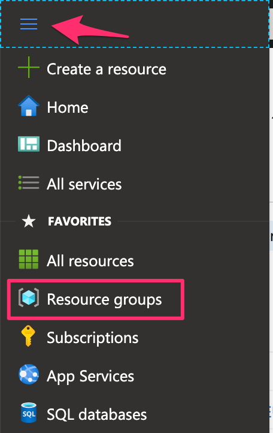
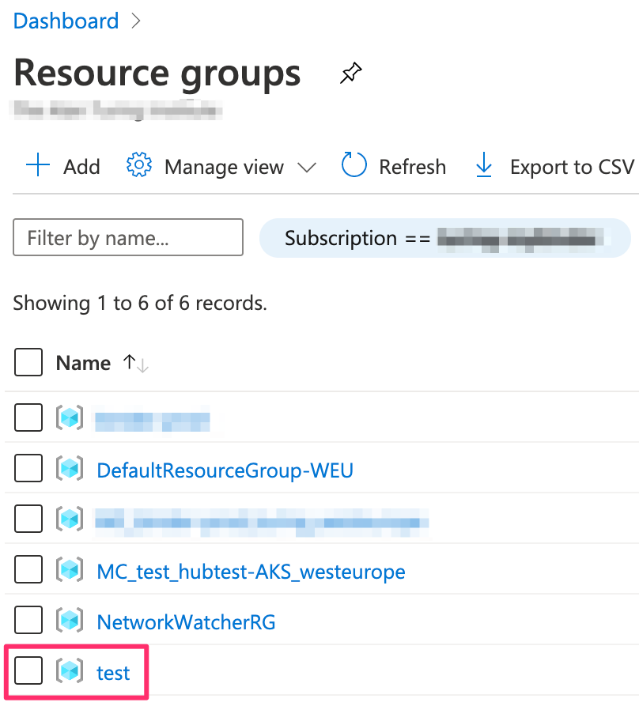
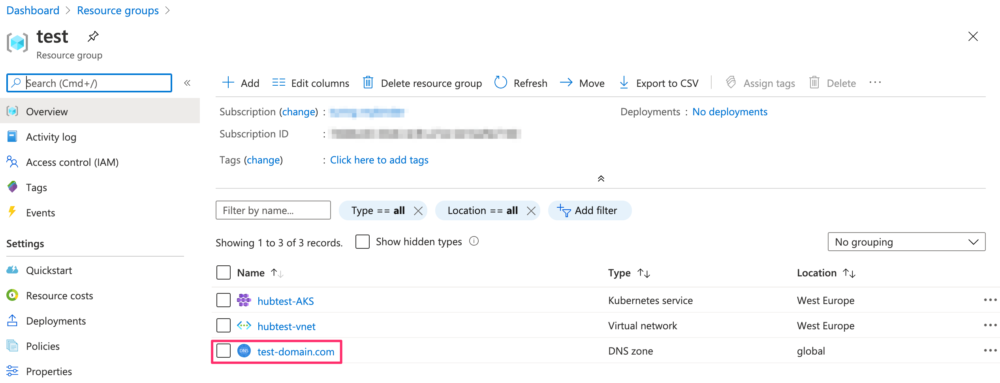
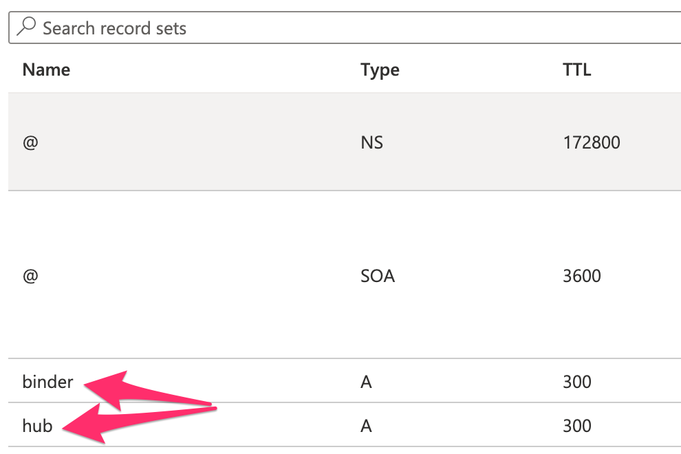
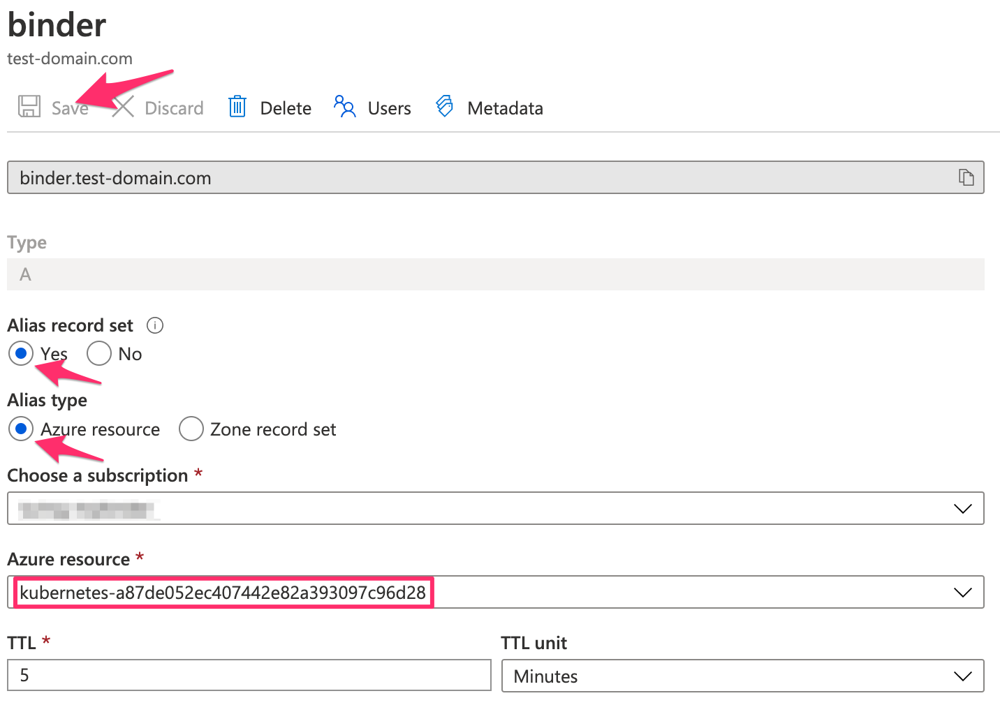

# Manually Setting A Records

Two A records are created for the Binder page and the JupyterHub and these records need to be set to the public IP address of the cluster's load balancer.
The package tries to complete this step automatically but often fails, due to the long-running nature of Azure's process to update the CLI.

To set the A records, the user could either wait some time (overnight is best) and then run [`set-a-records.sh`](../set_a_records.sh), or follow these steps to manually set the A records in [Azure Portal](https://portal.azure.com/).

---

1. Find the resource group

2. Open the DNS Zone

3. Select an A Record

You can set the `hub` and `binder` records in either order.

4. Set the A record

To set the A record, choose an "Alias record set" that will alias to an Azure resource.
Choose the subscription you deployed your BinderHub too, and then choose the Kubernetes IP address resource (it's name will have the `kubernetes-` prefix).
Then click save.

Repeat for the second A record.

Congratulations, you've set the A records for your BinderHub!
